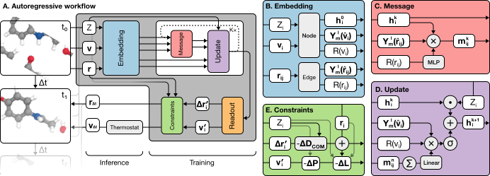

# <span style="font-size:larger;">TrajCast</span>

## Table of contents

- [About TrajCast](#about-trajcast)
- [Architecture overview](#architecture-overview) 
- [Getting Started](#getting-started)
  - [Installation](#installation)
  - [Training](#training)
  - [Inference](#inference)
  - [Resources](#resources)
- [Authors](#authors)
- [How to contribute](#how-to-contribute)
- [Citation](#citation)


## About TrajCast

*TrajCast* is a framework using autoregressive equivariant message-passing networks to evolve atomistic systems and generate molecular dynamics (MD) trajectories without relying on forces and solving the equations motion. Provided with a starting configuration comprising information about atom types, atomic positions, and velocities, *TrajCast* predicts displacements and new velocities for later state at time interval $\Delta t$. By rolling-out the predictions of *TrajCast* autoregressivley, a MD trajectory of the system of interest of arbitrary length can be generated. Naturally, using larger time intervals than classical MD simulations, *TrajCast* can generate long trajectories with fewer steps. For more details, please refer to our [preprint]([https://arxiv.org/](https://www.arxiv.org/abs/2503.23794)).


**Please note, this code is still under development.**

## Architecture overview

<p align="center">
    
</p>

**(A)** Autoregressive workflow: An atomistic system at time t0 is passed through an equivariant MPNN (grey box) to predict the new positions and velocities at time t1. Atomic attributes (positions, velocities, chemical elements) are encoded into initial features, which are refined over T message passing blocks. Estimates of the displacement and velocity vectors are generated based on the final features. These are then refined to ensure momentum conservation. The trajectory is built by rolling out predictions, where outputs from one step serve as inputs for the next. A thermostat ensures sampling from the canonical (NVT) ensemble at constant temperature T , with states following the Boltzmann distribution. **(B)** The embedding block encodes node and edge attributes and generates the initial features. **(C)** Messages are constructed by convolving latent features with filters derived from a learnable radial basis and the spherical harmonics expansion of edge vectors. **(D)** In the update block, messages from neighbors are pooled and combined via a tensor product with velocity vectors in a learnable radial and spherical harmonic basis. The result is passed through a non-linearity and added to the previous layer’s features, weighted by the node’s chemical element. **(E)** Conservation of total linear and angular momentum is enforced by adjusting the displacements and velocities.

## Getting started

### Installation

```sh
git clone https://github.ibm.com/AD-TrajCast/trajcast.git
cd trajcast
pip install torch==2.5.1
pip install torch_scatter torch_cluster -f https://data.pyg.org/whl/torch-2.5.1+cpu.html
pip install .
```

In case you have CUDA, you can install `cuEquivariance` to get faster results.

```sh
git clone https://github.ibm.com/AD-TrajCast/trajcast.git
cd trajcast
pip install torch==2.5.1
pip install torch_scatter torch_cluster -f https://data.pyg.org/whl/torch-2.5.1+cu121.html
pip install .[cueq]
```

For getting started, we also recommend installing the packages for our example notebooks:
```sh
pip install .[examples]
```

### Training

To train your own *TrajCast* model we recommend getting started with [this tutorial](examples/training/training.ipynb).

### Inference

To validate your own or one pretrained *TrajCast* model or generate a MD trajectory, please have a look at [this notebook](examples/inference/forecasting.ipynb).

### Resources

The model weights for a set of different chemical systems, as described in our [preprint](https://arxiv.org/), are available on [HuggingFace](https://huggingface.co/ibm-research/trajcast.models-arxiv2025). Dependent on the system, we use different time intervals:


| Model       | Time interval $\Delta t$ [fs] |
|-------------|----------|
| Paracetamol | 7   |
| Quartz      | 30    | 
| Water       | 5     |

The datasets used for training are available [here](https://huggingface.co/datasets/ibm-research/trajcast.datasets-arxiv2025).

## Authors

*Trajcast* is developed by:
- Fabian Thiemann
- Thiago Reschützegger
- Massimiliano Esposito

## How to contribute

If you find a bug or have a proposal for a feature, please post it in the [Issues](#). If you have a question, topic, or issue that isn’t obviously one of these, try our [GitHub Discussions](#).

Please feel free to reach out to [fabian.thiemann@ibm.com](mailto:fabian.thiemann@ibm.com) for any questions.

## Citation

If you use this work, consider citing our paper

```
@misc{thiemann2025Force-Free,
      title={Force-Free Molecular Dynamics Through Autoregressive Equivariant Networks}, 
      author={Fabian L. Thiemann and Thiago Reschützegger and Massimiliano Esposito and Tseden Taddese and Juan D. Olarte-Plata and Fausto Martelli},
      year={2025},
      eprint={2503.23794},
      archivePrefix={arXiv},
      primaryClass={physics.comp-ph},
      url={https://arxiv.org/abs/2503.23794}, 
}
```
